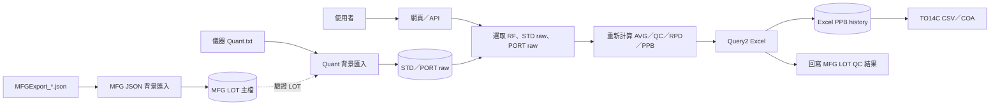

# 金兆益 GAS QC DataLoader

這是一個在 Windows 上執行的 `.NET 8` Web API／背景服務。它將儀器產生的 `Quant.txt` 匯入 SQL Server，讓使用者從網頁選取 RF、STD raw、PORT raw，重新計算並匯出 Query2 Excel、TO14C CSV 與 COA。

> 目前的核心原則：Quant 背景匯入只保存 STD／PORT raw。AVG、QC、RPD、PPB 會在使用者產生 Query2 時重新計算，不會在 Quant 匯入階段寫入衍生表。

## 先建立心智模型

系統同時包含三條流程：



| 流程 | 何時執行 | 主要輸入 | 主要輸出 |
| --- | --- | --- | --- |
| Quant 背景匯入 | 服務啟動後定時或每日執行 | `Quant.txt`、acqmeth、MFG LOT | STD raw、PORT raw、錯誤紀錄、processed state |
| MFG JSON 背景匯入 | 啟用後每隔一段時間掃描 | `MFGExport_*.json` | `ZZ_NF_GAS_MFG_LOT` |
| 手動 Query2／匯出 | 使用者操作網頁或呼叫 API | RF、STD raw、PORT raw | Query2、PPB history、QC 回寫、CSV、COA |

完整資料流與程式邊界請看[現行架構](src/JinZhaoYi.GasQcDataLoader/Docs/ARCHITECTURE.md)。

## 五分鐘開始

### 1. 必要環境

- Windows。
- `.NET SDK 9.0.302`：專案目標框架是 `net8.0`，但 `global.json` 固定使用此 SDK 建置。
- 可連線的 SQL Server，以及本系統需要的既有資料表。
- 若要產生正式版面 PDF，需安裝 LibreOffice；只有 Excel／CSV 功能時不需要。

先確認 SDK：

```powershell
dotnet --list-sdks
dotnet --version
```

### 2. 還原並測試

```powershell
dotnet restore .\JinZhaoYi.GasQcDataLoader.sln
dotnet test .\JinZhaoYi.GasQcDataLoader.sln
```

### 3. 第一次執行請使用安全設定

專案內的 `appsettings.json` 是正式環境風格，包含正式路徑，而且目前 `Scheduler:DryRun=false`。不要直接以預設值在未知環境啟動。

先建立空的測試資料夾：

```powershell
New-Item -ItemType Directory -Force C:\temp\gas-qc-local\input | Out-Null
New-Item -ItemType Directory -Force C:\temp\gas-qc-local\state | Out-Null
```

再啟動網頁與 API：

```powershell
dotnet run --project .\src\JinZhaoYi.GasQcDataLoader\JinZhaoYi.GasQcDataLoader.csproj -- `
  --urls=http://localhost:5080 `
  --Scheduler:WatchRoot=C:\temp\gas-qc-local\input `
  --Scheduler:ProcessedStatePath=C:\temp\gas-qc-local\state\processed-quant-files.json `
  --Scheduler:DryRun=true `
  --Scheduler:RunOnce=true `
  --Scheduler:MoveProcessedFilesToDone=false `
  --Scheduler:MfgJsonImport:Enabled=false `
  --Scheduler:DownloadApi:Enabled=true
```

開啟 <http://localhost:5080>。

> `DryRun=true` 不會寫入 GAS QC SQL 資料，也不會更新 processed state 或搬動來源檔案；但仍會讀取 SQL 主檔與 raw identity。使用獨立的測試輸入與 state 路徑，仍可避免誤用正式環境設定。

正式設定、排程模式、Windows Service 與故障排查請看[操作手冊](src/JinZhaoYi.GasQcDataLoader/Docs/RUNBOOK.md)。

## 專案目錄

```text
.
├─ src/JinZhaoYi.GasQcDataLoader/
│  ├─ Configuration/          設定模型
│  ├─ DataModels/             資料列、匯出、API request/response model
│  ├─ Services/Processing/    Quant 與 MFG JSON 背景 worker
│  ├─ Services/Service/       掃描、解析、計算、匯入與匯出流程
│  ├─ Services/Infrastructure SQL connection 與 Dapper repository
│  ├─ wwwroot/                內建前端
│  ├─ templates/              Query2 與 COA Excel 模板
│  └─ Docs/                   深入文件與 SQL scripts
└─ tests/JinZhaoYi.GasQcDataLoader.Tests/
```

目前幾個較大的技術集中點：

- `Program.cs`：DI 註冊、HTTP pipeline 與全部 API endpoints。
- `DapperRepository.cs`：SQL 查詢與交易。
- `Query2PreviewService.cs`：Query2 preview、手動覆寫與重算。
- `Query2WorkbookExporter.cs`：Query2 Excel 輸出。
- `CoaWorkbookExporter.cs`、`SpreadsheetPdfConverter.cs`：COA 與 PDF 版面。

## 文件導覽

| 想知道的事情 | 文件 |
| --- | --- |
| 現在系統到底怎麼流 | [現行架構](src/JinZhaoYi.GasQcDataLoader/Docs/ARCHITECTURE.md) |
| 本機執行、正式設定、排程、Log、服務維運 | [操作手冊](src/JinZhaoYi.GasQcDataLoader/Docs/RUNBOOK.md) |
| 完整 API 清單 | [API 參考](src/JinZhaoYi.GasQcDataLoader/Docs/API.md) |
| 資料表用途與 SQL scripts | [資料庫說明](src/JinZhaoYi.GasQcDataLoader/Docs/DATABASE.md) |
| Query2 的詳細計算方式 | [Query2 演算法](src/JinZhaoYi.GasQcDataLoader/Docs/Query2Excel_FromDbRawData_README.md) |
| Quant.txt 如何解析、欄位如何入 DB | [Quant Parser 與 DB Mapping](src/JinZhaoYi.GasQcDataLoader/Docs/QuantParser_DB_Mapping_README.md) |
| COA 欄位從哪裡來 | [COA 欄位對應](src/JinZhaoYi.GasQcDataLoader/Docs/COA_Field_Mapping_README.md) |
| MFG JSON 如何匯入 | [MFG JSON 匯入](src/JinZhaoYi.GasQcDataLoader/Docs/MFG_JSON_IMPORT_README.md) |
| 為何停止 Quant 自動衍生計算 | [ADR-0001](src/JinZhaoYi.GasQcDataLoader/Docs/ADR/0001-quant-raw-only.md) |

## 修改前先注意

- 「Quant 匯入」與「手動 Query2」是兩條不同計算時機，不要假設 Query2 會讀取舊衍生表。
- `ZZ_NF_GAS_QC_EXCEL_PPB_HISTORY` 是 CSV／COA 新流程的資料來源；`ZZ_NF_GAS_QC_LOT_PORT_PPB` 是舊流程資料。
- `Scheduler:DownloadApi:Enabled=false` 會讓所有 `/api/*` endpoints 都不註冊。
- 正式 Query2 匯出不只是產檔，還會保存 PPB history、編輯紀錄，並回寫 MFG LOT QC 結果。
- 專案沒有完整建立所有核心資料表的 migration；部署前要先確認目標 DB schema。
