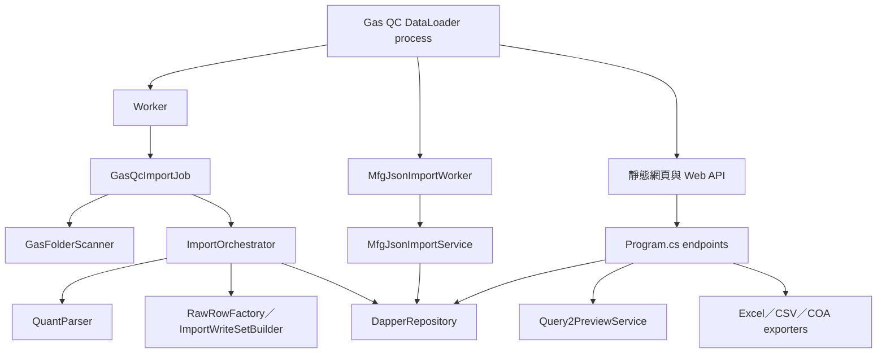
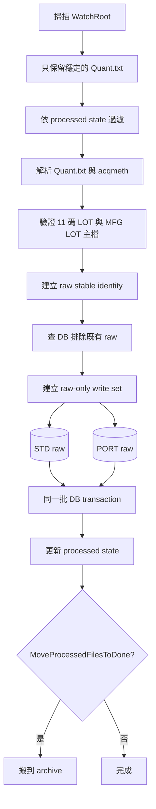
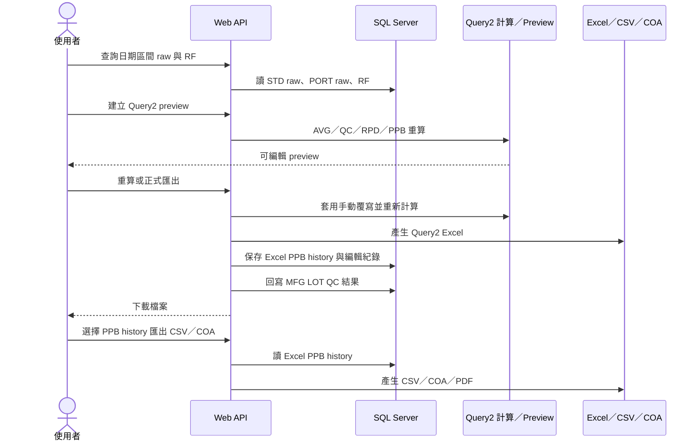

# 現行架構

本文件只描述目前程式實際會執行的行為。已停用的 Quant 自動衍生計算請看 [ADR-0001](ADR/0001-quant-raw-only.md)。

## 系統責任

GAS QC DataLoader 的責任分成三塊：

1. 將儀器資料轉成可追蹤、可重算的 STD／PORT raw 資料。
2. 讓使用者用指定 RF 與 raw 建立 Query2，並在正式匯出時保存結果與 QC 判定。
3. 將 MFG JSON 的 LOT 主檔同步進 GAS QC 使用的 MFG LOT table。

它不是完整 MES，也不是所有 GAS QC tables 的 schema 管理工具。核心主檔與部分資料表由外部系統或既有資料庫提供。

## 執行時元件

程式是單一 ASP.NET Core process，但同時啟動三種工作：

所有 `/api/*` endpoints 只有在 `Scheduler:DownloadApi:Enabled=true` 時才會註冊；`wwwroot` 靜態檔案則一律啟用。

## 流程一：Quant raw 匯入

目前不會在這條流程取得 RF，也不會產生或寫入 STD AVG/QC/RPD、PORT AVG/PPB/RPD。

### 成功與失敗界線

- 同一匯入 group 會先解析、驗證，再寫入 DB。
- `AllNewStableFiles` 模式下，單一 group 失敗後會記錄錯誤並繼續其他 group。
- `TargetDate` 模式下，失敗後會停止後續 group。
- DB raw identity 與 processed state 是兩層防重複機制。
- `DryRun=true` 不寫 GAS QC tables、不更新 processed state，也不搬動來源檔案；但仍會讀 DB 完成 LOT 與 raw identity 驗證。

## 流程二：手動 Query2 與後續匯出

正式 Query2 匯出的重要副作用：

- 保存 PPB snapshot 到 `ZZ_NF_GAS_QC_EXCEL_PPB_HISTORY`。
- 保存使用者修改 preview 的欄位紀錄。
- 依壓力與濃度規則判定 QC，回寫 `ZZ_NF_GAS_MFG_LOT`。
- 若有 QC 無法判定的資料，正式匯出與 DB 寫入會中止。

CSV 與 COA 的新流程讀取 Excel PPB history，不讀舊 `PORT_PPB` 新資料。

## 流程三：MFG JSON 匯入

`MfgJsonImportWorker` 只在 `Scheduler:MfgJsonImport:Enabled=true` 時工作：

1. 每隔 `PollIntervalSeconds` 掃描 `WatchDirectory` 最上層。
2. 只處理符合 `FilePattern` 且最後修改時間已超過 `StableFileSeconds` 的檔案。
3. 解析並 upsert `ZZ_NF_GAS_MFG_LOT`。
4. 使用獨立的 `StateFilePath` 防止重複處理。
5. 單檔失敗只記 Log，下一輪仍會再次掃描。

詳細欄位規則請看 [MFG JSON 匯入](MFG_JSON_IMPORT_README.md)。

## 關鍵資料來源

| 資料 | 系統如何使用 | 權威來源 |
| --- | --- | --- |
| MFG LOT | 驗證 Quant LOT、取得鋼瓶與 QC 回寫目標 | MFG JSON／既有 MES 資料 |
| RF | 手動 Query2 的第一列與計算基準 | RF table；也可從 STD raw 呼叫 RF Extractor 匯入 |
| STD／PORT raw | Query2 重新計算的原始測量值 | Quant 背景匯入 |
| Excel PPB history | CSV／COA 選單與匯出資料 | 成功產生 Query2 Excel 後的 snapshot |
| QC settings | 壓力與各 analyte 濃度門檻 | QC settings API／規則 tables |
| Dynamic AREA | Query2 額外 AREA 欄位與 PORT 值 | dynamic AREA tables |

## 重要不變條件

- Quant LOT 必須是 11 碼數字，且必須存在 MFG LOT 主檔。
- Query2 至少需要一個 RF、一筆 STD raw 與一筆 PORT raw。
- Query2 使用使用者選取的 raw 即時計算，不依賴舊衍生表。
- 正式 Query2 匯出、history 保存、edit log 與 QC 回寫視為同一個使用者工作流程。
- 表名可由 `Scheduler:Tables` 覆寫；SQL 與文件中的名稱是預設值。
- 日期字串使用 `yyyyMMdd`。

## 變更功能時從哪裡開始

| 需求 | 優先查看 |
| --- | --- |
| Quant 找不到檔案或日期分組錯誤 | `GasFolderScanner`、`GasQcImportJob` |
| Quant 欄位解析錯誤 | `QuantParser`、`RawRowFactory` |
| raw 寫入、查詢或 transaction | `DapperRepository` |
| AVG／QC／RPD／PPB 算法 | `Query2SelectionExportBuilder`、`CalculationService` |
| Preview 編輯或重算 | `Query2PreviewService` |
| Query2 Excel 欄位或樣式 | `Query2WorkbookExporter`、Excel template |
| COA Excel／PDF 版面 | `CoaWorkbookExporter`、`SpreadsheetPdfConverter`、COA templates |
| API request／response | `Program.cs`、`DataModels` |
| 前端操作 | `wwwroot/index.html`、`wwwroot/app.js`、`wwwroot/styles.css` |
