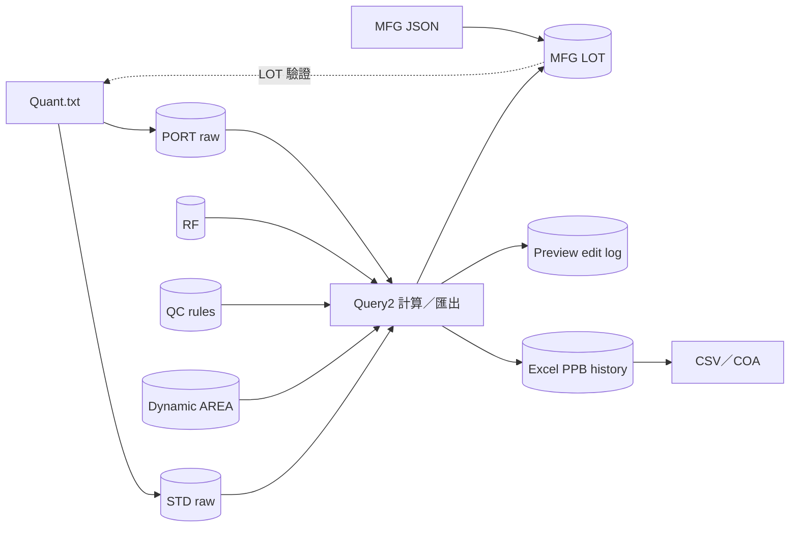

# 資料庫說明

GAS QC DataLoader 使用 SQL Server 與 Dapper。資料表名稱可由 `Scheduler:Tables` 覆寫；本文件使用程式預設名稱。

> 目前版本庫不是完整 database migration 專案。`Docs/sql` 只有後期功能的增量 scripts，無法從空白資料庫建立所有核心 tables。

## 資料表角色

### 現行核心流程

| 預設 table | 讀／寫 | 用途 |
| --- | --- | --- |
| `ZZ_NF_GAS_MFG_LOT` | 讀寫 | Quant LOT 驗證、MFG JSON upsert、鋼瓶資訊與 Query2 後 QC 結果回寫。 |
| `GAS_LOT_Bomb` | 讀 | 既有上游 MFG LOT parent 資料，部分 PPB／COA 查詢用來補足 LOT 資訊。 |
| `ZZ_NF_GAS_QC_RF` | 讀寫 | Query2 的 RF 選項；「從 STD 匯入 RF」功能會 upsert。 |
| `ZZ_NF_GAS_QC_LOT_STD` | 讀寫 | Quant 匯入的 STD raw；Query2 的原始資料來源。 |
| `ZZ_NF_GAS_QC_LOT_PORT` | 讀寫 | Quant 匯入的 PORT raw；Query2 的原始資料來源。 |
| `ZZ_NF_GAS_QC_EXCEL_PPB_HISTORY` | 讀寫 | Query2 成功匯出後保存的 PPB snapshot；新版 CSV／COA 的資料來源。 |
| `ZZ_NF_GAS_QC_QUERY2_PREVIEW_EDIT_LOG` | 寫 | `/from-preview` 正式匯出時保存使用者改動欄位。 |
| `ZZ_NF_GAS_QC_ERROR_LOG` | 讀寫 | Quant 匯入錯誤的 upsert 紀錄。 |

### Query2 動態欄位與 QC 規則

| 預設 table | 讀／寫 | 用途 |
| --- | --- | --- |
| `ZZ_NF_GAS_QC_QUERY2_DYNAMIC_AREA_FIELD` | 讀寫 | Dynamic AREA 欄位名稱、順序與啟用狀態。 |
| `ZZ_NF_GAS_QC_QUERY2_DYNAMIC_AREA_PORT_VALUE` | 讀寫 | Dynamic AREA 各 PORT 的值。 |
| `ZZ_NF_GAS_QC_PRESSURE_RULE` | 讀寫 | 0.5L／1L 的分析前、後壓力最低門檻。 |
| `ZZ_NF_GAS_QC_CONCENTRATION_RULE` | 讀寫 | 各 Container／analyte 的 PPB 上下限。 |

### 已停止新增資料的舊衍生表

| 預設 table | 現況 |
| --- | --- |
| `ZZ_NF_GAS_QC_LOT_STD_AVG` | Quant raw-only 後不再寫入新 AVG。 |
| `ZZ_NF_GAS_QC_LOT_STD_QC` | Quant raw-only 後不再寫入新 QC。 |
| `ZZ_NF_GAS_QC_LOT_STD_RPD` | Quant raw-only 後不再寫入新 RPD。 |
| `ZZ_NF_GAS_QC_LOT_PORT_AVG` | Quant raw-only 後不再寫入新 AVG。 |
| `ZZ_NF_GAS_QC_LOT_PORT_PPB` | Quant raw-only 後不再寫入新 PPB；舊 API 仍可讀既有資料。 |
| `ZZ_NF_GAS_QC_LOT_PORT_RPD` | Quant raw-only 後不再寫入新 RPD。 |

這些 tables 仍被舊相容程式碼與查詢參照。不要只因目前沒有新寫入就直接刪除；移除條件請看 [ADR-0001](ADR/0001-quant-raw-only.md)。

## 主要讀寫方向



## `Docs/sql` scripts

| Script | 前置條件 | 效果 |
| --- | --- | --- |
| [`create-qc-result-settings.sql`](sql/create-qc-result-settings.sql) | 無同名 table，或允許 script 補缺少 seed row | 建立壓力／濃度規則 tables，並加入 0.5L、1L 壓力規則空值 seed。 |
| [`alter-excel-ppb-history-area-precision.sql`](sql/alter-excel-ppb-history-area-precision.sql) | `ZZ_NF_GAS_QC_EXCEL_PPB_HISTORY` 已存在 | 將該表所有 `Area_*` decimal／numeric 欄位調整成 `decimal(28,12)`。 |
| [`alter-excel-ppb-history-export-session-id.sql`](sql/alter-excel-ppb-history-export-session-id.sql) | Excel PPB history 已存在 | 新增 nullable `ExcelExportSessionId` 與 filtered index。 |
| [`create-query2-preview-edit-log.sql`](sql/create-query2-preview-edit-log.sql) | 無同名 table | 建立 preview edit log 與查詢 indexes。 |

這些 scripts 大致具備「已存在則略過」或只調整必要欄位的保護，但執行前仍應備份並先在非正式資料庫驗證。

### 建議部署順序

1. 由正式 schema 來源準備所有核心 tables，包括 MFG LOT、RF、STD／PORT raw、Excel PPB history、錯誤表與 Dynamic AREA tables。
2. 執行 `create-qc-result-settings.sql`。
3. 執行 `alter-excel-ppb-history-area-precision.sql`。
4. 執行 `alter-excel-ppb-history-export-session-id.sql`。
5. 執行 `create-query2-preview-edit-log.sql`。
6. 使用下方檢查語句確認所有設定所指向的 tables 存在。

目前 repo **沒有**下列完整建表來源：

- 所有核心 GAS QC raw／RF／MFG LOT tables。
- Excel PPB history 的完整 `CREATE TABLE`。
- Dynamic AREA field／PORT value tables 的 `CREATE TABLE`。
- Import error log 的完整 `CREATE TABLE`。

因此若要支援全新環境，必須先從正式 DB schema 或另行維護的 DDL 補齊，不能只執行本資料夾四個 scripts。

## 部署前只讀檢查

以下查詢只檢查預設表名；若 `Scheduler:Tables` 有覆寫，要同步修改：

```sql
SELECT
    expected.TableName,
    CASE WHEN OBJECT_ID(N'dbo.' + expected.TableName, N'U') IS NULL
         THEN N'MISSING'
         ELSE N'OK'
    END AS SchemaStatus
FROM (VALUES
    (N'ZZ_NF_GAS_MFG_LOT'),
    (N'GAS_LOT_Bomb'),
    (N'ZZ_NF_GAS_QC_RF'),
    (N'ZZ_NF_GAS_QC_LOT_STD'),
    (N'ZZ_NF_GAS_QC_LOT_PORT'),
    (N'ZZ_NF_GAS_QC_EXCEL_PPB_HISTORY'),
    (N'ZZ_NF_GAS_QC_QUERY2_PREVIEW_EDIT_LOG'),
    (N'ZZ_NF_GAS_QC_QUERY2_DYNAMIC_AREA_FIELD'),
    (N'ZZ_NF_GAS_QC_QUERY2_DYNAMIC_AREA_PORT_VALUE'),
    (N'ZZ_NF_GAS_QC_PRESSURE_RULE'),
    (N'ZZ_NF_GAS_QC_CONCENTRATION_RULE'),
    (N'ZZ_NF_GAS_QC_ERROR_LOG')
) AS expected(TableName)
ORDER BY expected.TableName;
```

檢查 Excel PPB history 是否已有 export session 欄位：

```sql
SELECT
    COL_LENGTH(
        'dbo.ZZ_NF_GAS_QC_EXCEL_PPB_HISTORY',
        'ExcelExportSessionId'
    ) AS ExcelExportSessionIdColumnLength;
```

## Transaction 與一致性注意事項

- Quant raw 寫入由 repository 使用單一 transaction 處理該批 write set。
- DB raw identity 會在寫入前查重，processed state 則負責檔案層級防重複。
- Query2 正式匯出會依序產檔、保存 PPB history、回寫 MFG LOT QC；preview 路徑另外寫 edit log。修改其中一步時要重新檢查整個流程的一致性。
- `Scheduler:Tables` 只是改表名，不會替目標 table 建立 schema 或驗證欄位相容性。
- SQL 使用動態表名時會經過 repository 的 identifier quoting；設定仍只能指向受信任且 schema 相容的 table。

## 欄位 mapping

- Quant header、compound 與 raw table 欄位：[Quant Parser 與 DB Mapping](QuantParser_DB_Mapping_README.md)
- Query2 計算與 Excel 欄位：[Query2 Excel 演算法](Query2Excel_FromDbRawData_README.md)
- COA 欄位：[COA 欄位對應](COA_Field_Mapping_README.md)
- MFG JSON 欄位：[MFG JSON 匯入](MFG_JSON_IMPORT_README.md)
