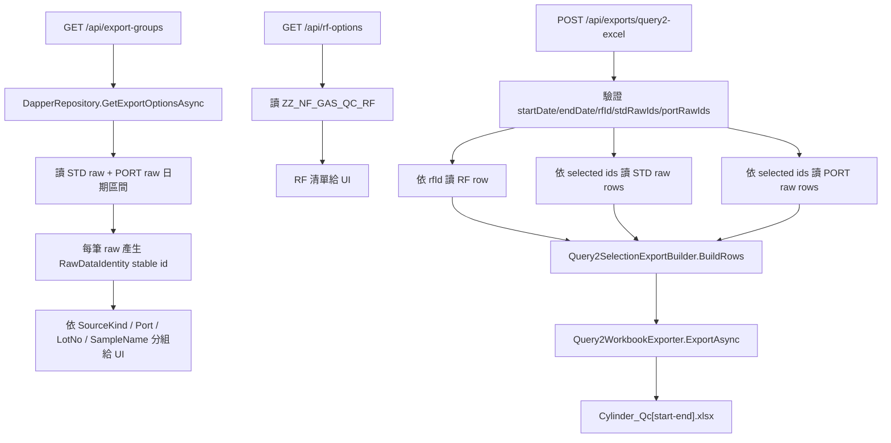
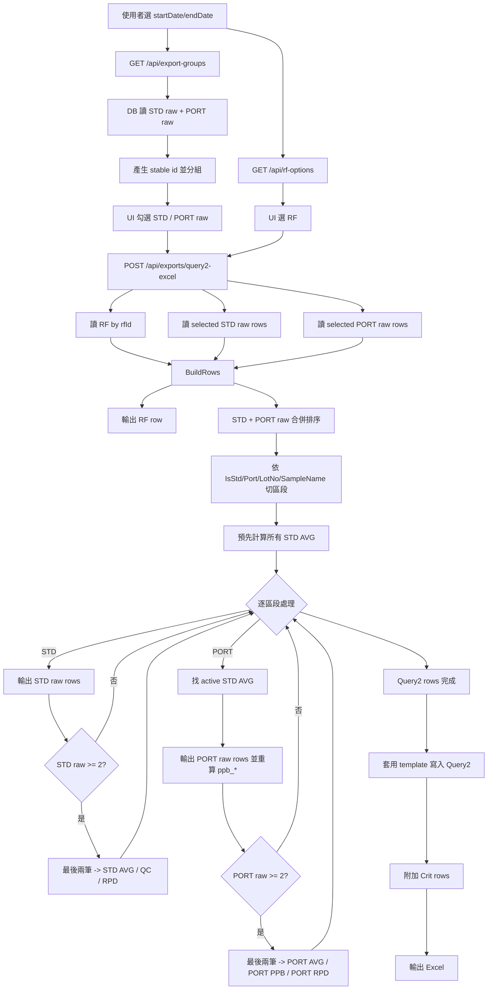

# Query2 Excel 從 DB RawData 產生演算法

本文說明使用 API 從 DB 已匯入資料匯出 `Cylinder_Qc[yyyyMMdd].xlsx` 的 `Query2` 工作表時，程式如何抓資料、排序、分組、計算與寫入 Excel。

目標情境：

1. 使用者在畫面選日期區間，例如 `2025/11/19` 到 `2025/11/20`。
2. 畫面從 DB 載入已匯入的 STD raw、PORT raw、RF。
3. 使用者勾選要匯出的 RF、STD raw、PORT raw。
4. API 依這些選取資料重新產生 Query2 Excel。

## 1. 相關程式

| 類別 | 職責 |
| --- | --- |
| `Program.cs` | 提供 `/api/export-groups`、`/api/rf-options`、`/api/exports/query2-excel`。 |
| `DapperRepository` | 從 DB 讀 RF、STD raw、PORT raw。 |
| `RawDataIdentity` | 產生穩定選取 id，讓 UI 勾選值能對回 DB raw rows。 |
| `Query2SelectionExportBuilder` | 依 RF、STD raw、PORT raw 建立 Query2 rows。 |
| `CalculationService` | 計算 AVG、RPD、PORT raw ppb、PORT PPB、STD QC。 |
| `Query2ColumnLayout` | 決定 Excel 欄位順序與輸出值。 |
| `Query2WorkbookExporter` | 套用 Excel template，寫入 `Query2` sheet。 |

## 2. API 資料流



## 3. UI 載入資料規則

### 3.1 日期區間

`GET /api/export-groups?startDate=yyyyMMdd&endDate=yyyyMMdd`

API 會驗證：

```text
startDate 格式 = yyyyMMdd
endDate 格式   = yyyyMMdd
startDate <= endDate
```

### 3.2 從 DB 抓 raw rows

程式從兩張 raw table 抓指定日期區間：

```sql
SELECT *
FROM dbo.ZZ_NF_GAS_QC_LOT_STD
WHERE CAST(AnlzTime AS date) >= @StartDate
  AND CAST(AnlzTime AS date) <= @EndDate;

SELECT *
FROM dbo.ZZ_NF_GAS_QC_LOT_PORT
WHERE CAST(AnlzTime AS date) >= @StartDate
  AND CAST(AnlzTime AS date) <= @EndDate;
```

注意：UI 載入的是 raw tables，不是 AVG/PPB/RPD tables。匯出時會依選取 raw rows 重新計算衍生列。

### 3.3 每筆 raw row 的 stable id

UI 勾選的 id 不是 DB 的 `ID` 或 `SID`，而是 `RawDataIdentity.ToStableId()` 產生的 SHA256。

組成內容：

```text
LotNo
Port
SampleNo
SampleName
AnlzTime ISO string
```

正規化規則：

```text
字串 trim 後轉大寫
空值轉空字串
SampleNo 用 invariant culture
AnlzTime 用 "O" 格式
```

這樣做是因為 DB raw `ID` 可能重複。例如 2025-11-19 的 PORT 2、SampleNo 23 多筆 raw 都可能是 `20251119023`，不能只靠 `ID` 勾選。

### 3.4 UI 分組與排序

`/api/export-groups` 回傳前會依下列 key 分組：

```text
SourceKind + Port + LotNo + SampleName
```

群組內 raw rows 排序：

```text
AnlzTime
SampleNo
SourceFolderName
```

群組排序：

```text
SourceKind
Port
LotNo
```

畫面會分成 STD、PORT、RF 三區。RF 由 `/api/rf-options` 另行讀取。

## 4. Query2 匯出 Request

`POST /api/exports/query2-excel`

Request 形狀：

```json
{
  "startDate": "20251119",
  "endDate": "20251120",
  "rfId": "RF,ppb(5841)",
  "stdRawIds": ["<RawDataIdentity stable id>"],
  "portRawIds": ["<RawDataIdentity stable id>"]
}
```

驗證規則：

```text
startDate/endDate 必須是 yyyyMMdd
startDate <= endDate
rfId 必填
stdRawIds 至少 1 筆
portRawIds 至少 1 筆
```

## 5. 匯出時 DB 讀取規則

### 5.1 讀 RF

```sql
SELECT TOP (1) *
FROM dbo.ZZ_NF_GAS_QC_RF
WHERE ID = @RfId
ORDER BY AnlzTime DESC, CREATE_TIME DESC, SID DESC;
```

### 5.2 讀選取的 STD/PORT raw

程式先讀日期區間內所有 STD raw + PORT raw，再用 selected ids 過濾。

排序規則：

```text
AnlzTime
SampleNo
SourceFolderName
DataFilename
```

實作位置：`DapperRepository.GetRawRowsForExportAsync`。

## 6. Query2 rows 產生演算法

入口：

```csharp
Query2SelectionExportBuilder.BuildRows(rf, stdRawRows, portRawRows)
```

### 6.1 第一列永遠是 RF

```text
Query2 row 1 = selected RF row
```

### 6.2 合併 STD/PORT raw 並排序

把使用者選取的 STD raw 與 PORT raw 合併後排序：

```text
AnlzTime
SampleNo
SourceFolderName
DataFilename
```

### 6.3 依連續區段切分

排序後逐筆掃描，當 key 改變就切成新區段。

分段 key：

```text
IsStd
SourceKind normalized
Port normalized
LotNo normalized
SampleName normalized
```

其中：

```text
IsStd = SourceKind == "STD" 或 Port == "STD"
```

這表示同一個 Port/Lot/SampleName 的連續 raw rows 會形成一個計算區段。

### 6.4 預先建立所有 STD AVG

對每個 STD 區段：

```text
如果 STD raw rows >= 2
取該區段最後兩筆 raw
計算 STD AVG
```

STD AVG 排序：

```text
AnlzTime
SampleNo
SourceFolderName
```

這份 STD AVG 清單會用來找 PORT 的 active STD AVG。

## 7. STD 區段產生規則

假設一個 STD 區段有 raw rows：

```text
STD1, STD2, STD3, STD4
```

輸出順序：

```text
STD1 Raw
STD2 Raw
STD3 Raw
STD4 Raw
AVG(STD3:STD4)
如果前面已有 STD AVG -> QC(previous STD AVG, current STD AVG)
RPD(STD3:STD4)
```

STD AVG：

```text
AVG Area_X = (STD3.Area_X + STD4.Area_X) / 2
```

STD RPD：

```text
RPD Area_X = (MAX(STD3.Area_X, STD4.Area_X) - MIN(STD3.Area_X, STD4.Area_X))
             / ((MAX + MIN) / 2)
```

STD QC：

```text
QC Area_X = (current STD AVG Area_X - previous STD AVG Area_X)
            / ((current STD AVG Area_X + previous STD AVG Area_X) / 2)
```

若 STD 區段少於 2 筆 raw，只輸出 raw rows，不輸出 AVG/RPD/QC。

## 8. PORT 區段產生規則

假設一個 PORT 區段有 raw rows：

```text
PORT1, PORT2, PORT3, PORT4, PORT5
```

輸出順序：

```text
PORT1 Raw
PORT2 Raw
PORT3 Raw
PORT4 Raw
PORT5 Raw
AVG(PORT4:PORT5)
ppb(PORT AVG si0_id)
RPD(PORT4:PORT5)
```

### 8.1 active STD AVG 選定

對 PORT 計算時，需要 active STD AVG。

規則：

```text
如果 PORT row 有 AnlzTime：
    使用 AnlzTime <= PORT row AnlzTime 的最後一個 STD AVG
    如果沒有較早 STD AVG，使用第一個 STD AVG
如果 PORT row 沒有 AnlzTime：
    使用最後一個 STD AVG
```

這個規則用在：

- PORT raw 的 `ppb_*`
- PORT PPB row 的 `Area_*`

### 8.2 PORT raw ppb

API 匯出時，PORT raw 的 `ppb_*` 會用 RF 和 active STD AVG 重新計算，不依賴 DB raw table 原本是否有 `ppb_*`。

```text
PORT raw ppb_X = RF.Area_X * PORT raw Area_X / active STD AVG Area_X
```

如果 RF、PORT raw Area、STD AVG Area 任一缺值、負值，或 STD AVG Area <= 0，結果為空值。

### 8.3 PORT AVG

只取 PORT 區段最後兩筆 raw：

```text
PORT AVG Area_X = (PORT4.Area_X + PORT5.Area_X) / 2
```

AVG row 不填 `ppb_*` 與 `RT_*`。

### 8.4 PORT PPB

PORT PPB 使用 PORT AVG 與 active STD AVG：

```text
PORT PPB Area_X = RF.Area_X * PORT AVG Area_X / active STD AVG Area_X
```

注意：PORT PPB 的結果寫在 `Area_*` 區，不寫在 `ppb_*` 區。這是 Query2 版型與現有 DB 設計。

### 8.5 PORT RPD

```text
PORT RPD Area_X = (MAX(PORT4.Area_X, PORT5.Area_X) - MIN(PORT4.Area_X, PORT5.Area_X))
                  / ((MAX + MIN) / 2)
```

若 PORT 區段少於 2 筆 raw，只輸出 raw rows，不輸出 AVG/PPB/RPD。

## 9. Excel 欄位寫入規則

`Query2ColumnLayout` 決定欄位順序。

```text
A:P   metadata
Q:BC  Area compound columns
BD:CO ppb compound columns
CP:EE RT compound columns
```

欄位順序：

```text
id
AnlzTime
Inst
Port
si0_id
SampleNo
LotNo
DataFilename
DataFilepath
PCName
Container
Description
EMVolts
RelativeEM
SampleName
SampleType
Area values...
ppb values...
RT values...
```

特殊顯示規則：

| 欄位 | 規則 |
| --- | --- |
| `id` | PPB row 且 `si0_id` 為 null/0 時顯示 `ppb(S{SampleNo})`。 |
| `si0_id` | `si0_id` 為 null/0 時顯示 `SampleNo`。 |
| `LotNo` | 可轉數字時寫數字，否則寫字串。 |
| `EMVolts` / `RelativeEM` | 可轉 decimal 時寫數字，否則寫字串。 |
| 空值 | 清空 cell contents。 |

## 10. Excel Template 套用規則

`Query2WorkbookExporter` 使用 `Scheduler:ExcelExport:TemplatePath`。

流程：

1. 開啟 template workbook。
2. 找到 `Query2` sheet。
3. 複製暫存 sheet `_Query2Template`。
4. 刪除其他 sheet，只保留 `Query2` 和暫存 sheet。
5. 從 template 第 4 列以後偵測 row type style：
   - `RF,` -> RF
   - `AVG(` -> AVG
   - `ppb(` -> PPB
   - `RPD(` -> RPD
   - `QC(` -> QC
   - `Crit(` -> Crit
   - 其他非空 id -> Raw
6. 刪除 `Query2` 第 4 列以後既有資料。
7. 依產生的 Query2 rows 複製對應 style row 並寫值。
8. 將 template 中的 Crit rows 加到最後。
9. 刪除 `_Query2Template`。
10. 回傳 Excel bytes，檔名為 `Cylinder_Qc[startDate-endDate].xlsx`。

## 11. 完整演算法流程圖



## 12. 與 `Cylinder_DataBase_20251119.xlsx` 的 5 格差異

`Cylinder_DataBase_20251119.xlsx` 的 Query2 大部分符合上述標準演算法，但有 5 格公式不是標準公式，而是人工或特殊規則改過。

| Cell | id | compound | 原始公式 | 標準公式會用 |
| --- | --- | --- | --- | --- |
| `BC17` | `ppb(5900)` | HCBD | `BC4*BC15/BC9` | `BC4*BC16/BC9` |
| `AT25` | `ppb(5901)` | p-Xylene | `AT4*AT23/AT7` | `AT4*AT24/AT9` |
| `BB63` | `ppb(5904)` | 1,2,4-TCB | `BB4*BB61/BB75` | `BB4*BB62/BB54` |
| `S71` | `ppb(5905)` | Methylene Chloride | `S4*S70/S52` | `S4*S70/S54` |
| `BB71` | `ppb(5905)` | 1,2,4-TCB | `BB4*BB70/BB75` | `BB4*BB70/BB54` |

其中 `BC17` 可由 raw data 明確看出異常：

```text
PORT 2[20251119 1132]_023.D
HCBD response = 173,958
同群正常值約 13,500,000
```

所以原始 Excel 避開該異常 raw，改用下一筆 raw。其餘 4 格更像是人工指定特定 STD row 或下一組 STD AVG 當分母。

目前程式採用標準演算法，不會自動重現這 5 格人工公式。若未來需要 100% 對齊原始活頁簿，需要新增 compound-level formula override table 或設定，例如：

```text
ppb(5900), HCBD -> numerator 使用指定 PORT raw
ppb(5901), p-Xylene -> numerator/denominator 使用指定 row
ppb(5904), 1,2,4-TCB -> denominator 使用下一組 STD AVG
ppb(5905), Methylene Chloride -> denominator 使用指定 STD raw
ppb(5905), 1,2,4-TCB -> denominator 使用下一組 STD AVG
```

