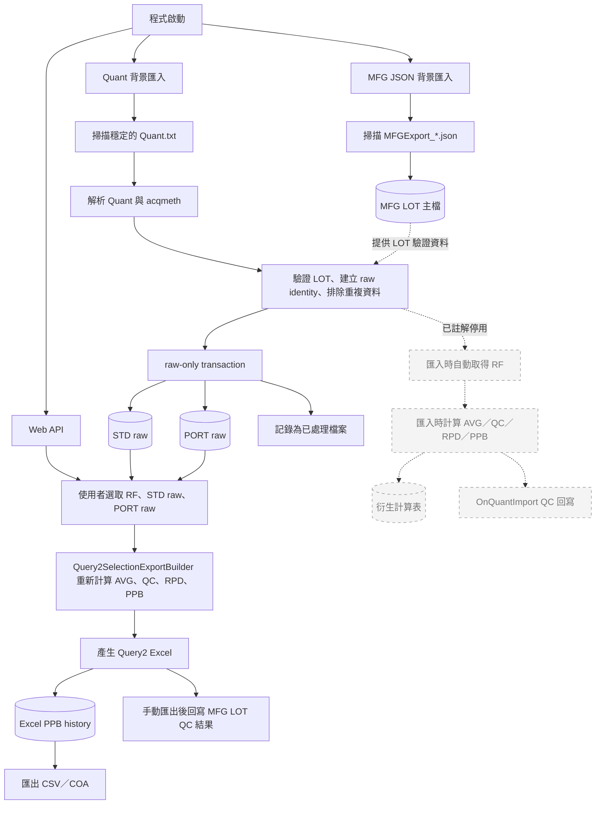

# JinZhaoYi Gas QC DataLoader

此專案是 `.NET 8` Windows Service / Web API，負責 GAS QC 資料匯入、Query2 Excel 匯出、Excel PPB CSV/COA 匯出，以及正式區暫時使用的 MFG JSON 同步。

## 主要功能

- 掃描 GAS 資料夾中的 `Quant.txt`，解析後寫入 SQL Server Gas QC tables。
- 依使用者選取的 RF / STD raw / PORT raw 產生 Query2 Excel。
- Query2 Excel 成功產生後，將 PPB row 保存到 `ZZ_NF_GAS_QC_EXCEL_PPB_HISTORY`。
- 使用 Excel PPB history 匯出 TO14C CSV、COA 大卡、COA 小卡。
- 掃描 `C:\temp\data\MFGJSON` 的 `MFGExport_*.json`，同步寫入 `ZZ_NF_GAS_MFG_LOT`。
- 提供前端查詢、匯出與下載 API。

## 專案結構

| 目錄 | 說明 |
| --- | --- |
| `Configuration` | `Scheduler`、table name、Excel/CSV/COA/API/MFG JSON/logging 設定模型。 |
| `DataModels` | Quant、LOT、RF、QC row、Query2、CSV、COA、MFG JSON、API DTO。 |
| `Services/Infrastructure` | SQL connection factory 與 Dapper repository。 |
| `Services/Service` | Scanner、parser、calculation、import/export orchestration、MFG JSON 匯入服務。 |
| `Services/Processing` | 背景 worker loop，包含 Quant 匯入 worker 與 MFG JSON import worker。 |
| `Docs` | 匯入流程、欄位 mapping、Query2、COA、MFG JSON 文件。 |

## 資料表

表名可由 `Scheduler:Tables` 設定覆寫，主要預設如下：

| 用途 | Table |
| --- | --- |
| MFG LOT 主檔 | `ZZ_NF_GAS_MFG_LOT` |
| RF | `ZZ_NF_GAS_QC_RF` |
| STD raw | `ZZ_NF_GAS_QC_LOT_STD` |
| STD AVG | `ZZ_NF_GAS_QC_LOT_STD_AVG` |
| STD QC | `ZZ_NF_GAS_QC_LOT_STD_QC` |
| STD RPD | `ZZ_NF_GAS_QC_LOT_STD_RPD` |
| PORT raw | `ZZ_NF_GAS_QC_LOT_PORT` |
| PORT AVG | `ZZ_NF_GAS_QC_LOT_PORT_AVG` |
| PORT PPB | `ZZ_NF_GAS_QC_LOT_PORT_PPB` |
| PORT RPD | `ZZ_NF_GAS_QC_LOT_PORT_RPD` |
| Excel PPB history | `ZZ_NF_GAS_QC_EXCEL_PPB_HISTORY` |
| 匯入錯誤紀錄 | `ZZ_NF_GAS_QC_ERROR_LOG` |

`ZZ_NF_GAS_QC_LOT_PORT_PPB` 是舊版匯入計算流程使用的 PPB table，目前已停止寫入新資料；手動 CSV/COA 匯出清單改讀 `ZZ_NF_GAS_QC_EXCEL_PPB_HISTORY`，代表使用者成功產生 Query2 Excel 後保存的 PPB 快照。

## 手動 Query2 與自動匯入計算

目前使用者手動產生 Query2 Excel 時，API 只會取得當次選取的 RF、STD raw 與 PORT raw，再由 `Query2SelectionExportBuilder` 重新計算 AVG、QC、RPD 與 PPB。手動 Query2 不讀取自動 Quant 匯入時寫入的 AVG/QC/RPD/PPB 計算表。

### 目前程式邏輯圖



實線是目前仍會執行的流程；灰色虛線是已保留程式碼、但暫時註解停用的自動匯入計算流程。

| 流程 | 手動 Query2 是否需要 | 目前處理 |
| --- | --- | --- |
| 解析 `Quant.txt` 與 acqmeth | 需要 | 保留，提供 raw 測量值與 EM 資料。 |
| 驗證 LOT、建立 raw identity、防止重複匯入 | 需要 | 保留。 |
| 寫入 `STD raw` / `PORT raw` | 需要 | 保留，這是手動 Query2 的資料來源。 |
| 匯入時取得 RF | 不需要 | **已暫時停用**；使用者在手動 Query2 匯出時才選擇 RF。 |
| 匯入時計算 AVG/QC/RPD/PPB | 不需要 | **已暫時停用**；舊計算程式碼保留在 `ImportWriteSetBuilder` 與 `DapperRepository`。 |
| 寫入 AVG/QC/RPD/PPB 計算表 | 不需要 | **已暫時停用**；Quant 匯入 transaction 目前只寫入 raw。 |

### 為什麼現在不直接移除

這些匯入計算是專案初期「Quant 自動匯入並將原始資料與計算結果寫入 DB」的流程。後來才加入由使用者選擇 raw 與 RF、手動產生 Query2 的流程。目前已將自動匯入階段的 RF 取得、衍生計算、衍生表寫入與匯入時 QC 回寫暫時停用，但舊程式碼仍保留並在呼叫點註解，沒有刪除。

### 停用後的影響範圍

- 不影響手動 Query2 Excel：仍從使用者選取的 RF、STD raw 與 PORT raw 重新計算。
- 不影響 Query2 匯出後的 Excel PPB history、`/api/exports/excel-ppb-csv`、COA 大卡與小卡。
- `STD_AVG`、`STD_QC`、`STD_RPD`、`PORT_AVG`、`PORT_PPB`、`PORT_RPD` 不再產生新資料，既有資料不會被刪除。
- 舊版 `GET /api/port-ppb-options` 與 `POST /api/exports/port-ppb-csv` 仍可讀取現有 `PORT_PPB` 資料，但不會再看到新 Quant 匯入產生的 PPB。新流程應使用 Excel PPB history 匯出 API。
- `Scheduler:QcResultWriteback:OnQuantImport` 目前不會執行；手動 Query2 成功匯出後的 QC 回寫仍正常執行。

### 如何恢復舊自動計算

1. 在 `ImportOrchestrator.ImportCandidatesAsync` 取消 RF 查詢與 `BuildWriteSet` 區塊的註解，並移除 raw-only `rf` / `writeSet`。
2. 在 `DapperRepository.ExecuteImportAsync` 取消 `ProcessStdGroupAsync` / `ProcessPortGroupAsync` 與 QC 回寫區塊的註解，並停用 `ProcessRawGroupOnlyAsync`。
3. 執行完整測試，並用正式資料比對 AVG、QC、RPD、PPB 與 MFG LOT QC 回寫。

若未來要正式移除而非暫時停用，必須先完成：

1. 確認外部 MES、報表或其他程式沒有直接讀取 `STD_AVG`、`STD_QC`、`STD_RPD`、`PORT_AVG`、`PORT_PPB`、`PORT_RPD` 表。
2. 將舊版 `GET /api/port-ppb-options` 與 `POST /api/exports/port-ppb-csv` 改為重新計算，或改讀 `ZZ_NF_GAS_QC_EXCEL_PPB_HISTORY`。
3. 確認 `Scheduler:QcResultWriteback:OnQuantImport` 永久停用，或將該 QC 回寫完整移到手動 Query2 匯出流程。
4. 使用正式資料回歸驗證 Query2、CSV、COA 與 QC 回寫結果後，才移除匯入階段的 RF 依賴與衍生表寫入。

## 重要設定

主要設定在 `src/JinZhaoYi.GasQcDataLoader/appsettings.json` 與正式環境覆寫設定。

| Setting | 說明 |
| --- | --- |
| `ConnectionStrings:Connection` | SQL Server 連線字串。 |
| `Scheduler:WatchRoot` | GAS 根目錄。 |
| `Scheduler:TargetMode` | `TargetDate` 處理指定日期；`AllNewStableFiles` 處理所有穩定且未處理檔案。 |
| `Scheduler:StableFolderMinutes` | `.D` folder 穩定多久後才處理。 |
| `Scheduler:DryRun` | `true` 時只解析、驗證與計算，不寫 DB。 |
| `Scheduler:RunOnce` | `true` 時跑一輪後結束。 |
| `Scheduler:BackfillEnabled` / `BackfillTargetDate` | 補跑指定 `yyyyMMdd` 日期。 |
| `Scheduler:MoveProcessedFilesToDone` | 成功後是否搬到 archive。 |
| `Scheduler:UseAverageSnapshotTables` | `true` 時 AVG tables 保持 snapshot 行為；`false` 時保留 AVG history。 |
| `Scheduler:ExcelExport:Enabled` | 是否輸出 Query2 Excel。 |
| `Scheduler:ExcelExport:TemplatePath` | Query2 Excel template 路徑。 |
| `Scheduler:CsvExport:*` | TO14C CSV 欄位與預設值設定。 |
| `Scheduler:CoaExport:*` | COA 大卡/小卡 template 設定；小卡 A4 版型固定每頁 9 格。 |
| `Scheduler:DownloadApi:Enabled` | 是否啟用查詢、匯出與下載 API。 |
| `Scheduler:MfgJsonImport:Enabled` | 是否啟用 MFG JSON 背景匯入。 |
| `Scheduler:MfgJsonImport:WatchDirectory` | MFG JSON 掃描資料夾，正式預設 `C:\temp\data\MFGJSON`。 |
| `Scheduler:MfgJsonImport:FilePattern` | MFG JSON 檔名 pattern，預設 `MFGExport_*.json`。 |
| `Scheduler:MfgJsonImport:StateFilePath` | MFG JSON 處理狀態檔，預設 `C:\temp\data\MFGJSON\MfgJsonImportState.json`。 |

## Log

Log 會放在執行目錄底下的 `LOG`，並依用途分資料夾：

| 路徑 | 說明 |
| --- | --- |
| `LOG\Application\app-YYYYMMDD.log` | 一般程式執行 log。 |
| `LOG\Sync\cycle-YYYYMMDD.log` | 一輪 Quant 同步週期追蹤：worker 等待、掃描週期開始/結束、成功/失敗統計。 |
| `LOG\Sync\import-YYYYMMDD.log` | Quant 匯入流程追蹤：解析批次、LOT 驗證、RF 取得、寫入資料集合建立、DB 寫入前後訊息。 |
| `LOG\Sync\state-YYYYMMDD.log` | processed-quant-files.json 狀態追蹤：已處理檔案比對、略過筆數、待處理筆數、state 更新結果。 |
| `LOG\DataRead\scanner-YYYYMMDD.log` | 資料夾與 Quant 候選檔掃描追蹤：來源路徑、批次資料夾、穩定檔案數、候選檔案數。 |
| `LOG\DataRead\quant-YYYYMMDD.log` | Quant / acqmeth 讀檔解析追蹤：讀檔路徑、LOT、SampleNo、Acq On、compound 數、EMVolts、RelativeEM。 |
| `LOG\MFGJSON\scan-YYYYMMDD.log` | MFG JSON 掃描、略過、成功、失敗、insert/update 筆數。 |
| `LOG\serilog-selflog.txt` | Serilog 自身錯誤備援 log。 |

## API

啟用 `Scheduler:DownloadApi:Enabled=true` 後提供：

| Endpoint | 說明 |
| --- | --- |
| `GET /api/export-groups?startDate=yyyyMMdd&endDate=yyyyMMdd` | 從 DB raw tables 讀取日期區間資料，回傳前端可勾選的 STD/PORT/Lot/SampleName group。 |
| `GET /api/rf-options` | 從 RF table 讀取 RF rows。 |
| `POST /api/exports/query2-excel` | 依前端選取的 RF、STD raw、PORT raw 產生 Query2 Excel，成功後保存 Excel PPB history。 |
| `GET /api/excel-ppb-options?batchDate=yyyyMMdd&page=1&pageSize=50` | 讀取 Query2 Excel 成功產生後保存的 PPB history，供 CSV/COA 勾選。 |
| `POST /api/exports/excel-ppb-csv` | 依 Excel PPB history 匯出 TO14C CSV。 |
| `POST /api/exports/excel-ppb-coa-large` | 依 Excel PPB history 匯出 COA 大卡，支援一般/亞東 template。 |
| `POST /api/exports/excel-ppb-coa-small` | 依 Excel PPB history 匯出 COA 小卡；每支鋼瓶 1 張小卡，同一頁最多 9 張，超過自動換頁。 |
| `GET /api/downloads/cylinder-qc/{batchDate}` | 下載既有 `Cylinder_Qc[{batchDate}].xlsx`。 |
| `GET /api/downloads/to14c-csv/{sampleName}` | 下載指定 sample 的 TO14C CSV。 |

## 常用指令

Build/test：

```powershell
dotnet test .\JinZhaoYi.GasQcDataLoader.sln
```

手動跑一輪 Quant 匯入：

```powershell
dotnet run --project .\src\JinZhaoYi.GasQcDataLoader\JinZhaoYi.GasQcDataLoader.csproj -- --Scheduler:RunOnce=true --Scheduler:StableFolderMinutes=0 --Scheduler:DryRun=false
```

手動補跑指定日期：

```powershell
dotnet run --project .\src\JinZhaoYi.GasQcDataLoader\JinZhaoYi.GasQcDataLoader.csproj -- --Scheduler:RunOnce=true --Scheduler:BackfillEnabled=true --Scheduler:BackfillTargetDate=20251119 --Scheduler:StableFolderMinutes=0 --Scheduler:DryRun=false
```

## 相關文件

| 文件 | 說明 |
| --- | --- |
| `Query2Excel_FromDbRawData_README.md` | 從 DB raw data 產生 Query2 Excel 的演算法與資料流。 |
| `QuantParser_DB_Mapping_README.md` | `Quant.txt` 解析與 DB 欄位 mapping。 |
| `COA_Field_Mapping_README.md` | COA 大卡/小卡欄位來源與填值規則。 |
| `MFG_JSON_IMPORT_README.md` | MFG JSON 背景匯入、欄位 mapping、狀態檔與 log 說明。 |
