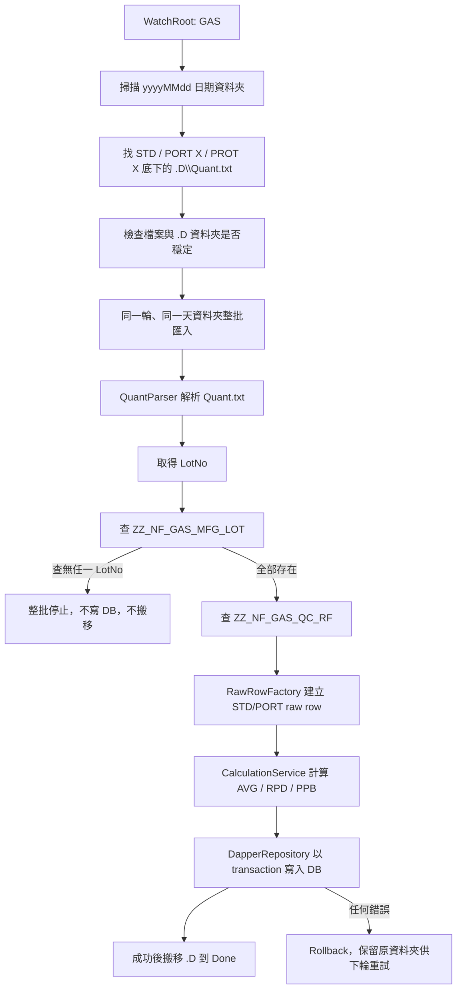

# Gas QC DataLoader 程式碼流程與資料流說明書

## 1. 文件目的

本文說明 `JinZhaoYi.GasQcDataLoader` 的程式碼執行流程、資料來源、資料流向、主要計算規則與資料表責任。

本系統的目標是監測金兆益 Gas QC 每日資料夾，解析 `STD` 與 `PORT X` 底下每個 `.D\Quant.txt`，將原始資料與計算結果寫入 `NEWFAST_1029` 的 `ZZ_NF_GAS_QC_*` 資料表。

## 2. 系統定位

| 項目 | 說明 |
| --- | --- |
| 專案型態 | `.NET 8 Worker Service` |
| 執行模式 | 可用 Console 執行，也可部署為 Windows Service |
| 入口點 | `Program.cs` |
| 背景服務 | `Services/Processing/Worker.cs` |
| 排程 Job | `Services/Service/GasQcImportJob.cs` |
| 主要流程協調 | `Services/Service/ImportOrchestrator.cs` |
| DB 存取 | `Services/Infrastructure/DapperRepository.cs` |
| 設定檔 | `appsettings.json` 的 `Scheduler` 區段 |

## 3. 重要資料來源責任

| 資料來源 | 責任 | 程式是否修改 |
| --- | --- | --- |
| `Quant.txt` | 正式匯入來源。提供 compound 的 `Response`、`R.T.`，以及 Misc 區塊中的 `LotNo` 等資訊。 | 不修改，只讀取 |
| `ZZ_NF_GAS_MFG_LOT` | 人工維護的 LOT 主檔。提供 `LotNo` 驗證，以及 `SamplName`、`SampleNo`、`SampleType`、`Container`、`EMVolts`、`RelativeEM` 等主檔欄位。 | 不修改，只查詢 |
| `ZZ_NF_GAS_QC_RF` | RF 參考係數來源。提供各 compound 的 RF `Area_*`。 | 不修改，只查詢 |
| `Cylinder_DataBase_20251119.xlsx` | 只作公式與結果驗證參考。Excel 是單頭單身扁平報表，不作正式匯入來源。 | 不修改，只人工比對 |
| `STD/PORT X/*.D` 資料夾 | 成功匯入後搬移到 `Done`。 | 搬移資料夾 |

注意：`ZZ_NF_GAS_MFG_LOT` 是人員會輸入與維護的主檔，程式正式流程不應自動更新這張表。若 Excel 與 MFG_LOT 欄位不同，應以 MFG_LOT 為正式 DB 主檔來源，Excel 只用於公式比對。

## 4. 資料夾結構

系統監測 `Scheduler:WatchRoot`，預設是：

```text
C:\Users\Andy\Downloads\download_2026-04-14_17-26-38\GAS
```

每日資料夾格式：

```text
GAS\
└─ 20251119\
   ├─ STD\
   │  ├─ STD[20251119 0947]_903.D\
   │  │  └─ Quant.txt
   │  └─ ...
   ├─ PORT 2\
   │  ├─ PORT 2[20251119 1047]_023.D\
   │  │  └─ Quant.txt
   │  └─ ...
   ├─ PORT 3\
   └─ Done\
```

程式也支援現場資料夾 typo：`PROT 11` 會被辨識為 `PORT 11`。

## 5. 整體資料流



## 6. 程式碼進入點與執行流程

### 6.1 `Program.cs`

`Program.cs` 負責建立 .NET Generic Host，註冊設定、Log、DI 服務與 BackgroundService。

主要註冊項目：

| 服務 | 實作 | 責任 |
| --- | --- | --- |
| `IGasFolderScanner` | `GasFolderScanner` | 掃描資料夾與 Quant.txt |
| `IQuantParser` | `QuantParser` | 解析 Quant.txt |
| `IRawRowFactory` | `RawRowFactory` | 建立 raw DB row |
| `ICalculationService` | `CalculationService` | 計算 AVG、RPD、PPB |
| `IDapperRepository` | `DapperRepository` | SQL Server 查詢與寫入 |
| `IImportOrchestrator` | `ImportOrchestrator` | 匯入流程協調 |
| `IJob` | `GasQcImportJob` | 每輪排程工作 |
| `BackgroundService` | `Worker` | 常駐輪詢與 RunOnce 控制 |

### 6.2 `Worker.ExecuteAsync`

`Worker` 是 BackgroundService。

流程：

1. 呼叫 `IJob.ExecuteAsync()` 執行一輪。
2. 若 `Scheduler:RunOnce=true`，執行一輪後呼叫 `StopApplication()` 結束程式。
3. 若 `RunOnce=false`，等待 `IntervalSeconds` 後繼續下一輪。
4. 最短等待秒數受 `MinimumIntervalSeconds` 保護，避免忙迴圈。

### 6.3 `GasQcImportJob.ExecuteAsync`

`GasQcImportJob` 是每輪實際排程邏輯。

流程：

1. 讀取 `StableFolderMinutes`，換算穩定等待時間。
2. 呼叫 `GasFolderScanner.FindStableQuantFiles()` 找到本輪可處理的 Quant.txt。
3. 依 `DayFolderPath` 分組。
4. 每個日期資料夾呼叫 `ImportOrchestrator.ImportCandidatesAsync()` 做整批匯入。
5. 若匯入成功，逐一將 `.D` 資料夾搬到 `yyyyMMdd\Done\{TopFolderName}`。
6. 若匯入失敗，本輪停止，未搬移的資料保留在原處供下輪重試。
7. 每輪結束都寫入完成 log，包含成功、失敗、搬移與耗時統計。

整批匯入很重要：AVG/RPD/PPB 需要依同一段連續 STD 或 PORT 群組的最後兩筆計算。如果逐檔匯入，RPD 會太早產生，無法對齊 Excel Query2。

## 7. 掃描與穩定判斷

### 7.1 `GasFolderScanner.FindStableQuantFiles`

掃描條件：

1. `WatchRoot` 底下只處理名稱符合 `yyyyMMdd` 的日期資料夾。
2. 日期資料夾底下只處理：
   - `STD`
   - `PORT X`
   - `PROT X`，視為 `PORT X`
3. 遞迴尋找 `Quant.txt`。
4. 檔案與 `.D` 資料夾的 `LastWriteTime` 都必須早於穩定截止時間。

排序規則：

1. 優先用 `.D` 資料夾名稱中的 `[yyyyMMdd HHmm]` 解析分析時間。
2. 解析失敗時退回資料夾 `LastWriteTime`。
3. 再用完整路徑穩定排序。

## 8. Quant.txt 解析

### 8.1 `QuantParser`

`QuantParser` 將每個 `Quant.txt` 解析成 `ParsedQuantFile`。

主要資料：

| 解析結果 | 來源 |
| --- | --- |
| `AcquiredAt` | `.D` 資料夾名稱的 `[yyyyMMdd HHmm]` |
| `SourceKind` | 上層資料夾 `STD` 或 `PORT X` |
| `Port` | `STD` 或 `PORT X` |
| `DataFilename` | 相對於 `STD/PORT X` 的路徑，例如 `PORT 2[...].D\Quant.txt` |
| `DataFilepath` | `.D` 實際資料夾路徑 |
| `LotNo` | Quant Misc 區塊最後資訊解析 |
| compound `Response` | 寫入 `Area_*` |
| compound `R.T.` | 寫入 `RT_*` |
| compound `Conc` | STD 不採用；PORT raw 也以公式重算 ppb |

## 9. LOT 與 RF 查詢

### 9.1 LOT 查詢

`ImportOrchestrator` 會先收集整批 `ParsedQuantFile` 的 LotNo，呼叫：

```text
DapperRepository.GetLotsByLotNoAsync()
```

查詢資料表：

```text
ZZ_NF_GAS_MFG_LOT
```

若任一 LotNo 查不到：

1. 整批停止。
2. 不寫入 raw。
3. 不寫入 AVG/RPD/PPB。
4. 不搬移 `.D` 資料夾。

### 9.2 RF 查詢

`DapperRepository.GetLatestRfAsync()` 從 `ZZ_NF_GAS_QC_RF` 取得 RF。

目前查詢邏輯：

1. 優先找 `AnlzTime` 日期等於本批最早 Quant 日期的 RF。
2. 否則找 `AnlzTime <= asOf` 的最近 RF。
3. 再依 `AnlzTime DESC`、`CREATE_TIME DESC`、`SID DESC` 排序。

## 10. Raw Row 建立

### 10.1 `RawRowFactory`

`RawRowFactory.Create()` 會把 `ParsedQuantFile` 與 `MfgLot` 合併成 `QcDataRow`。

主要欄位來源：

| DB 欄位 | 來源 |
| --- | --- |
| `ID` | 程式產生，格式 `yyyyMMdd + SampleNo` |
| `AnlzTime` | Quant `.D` 資料夾時間 |
| `Inst` | `Scheduler:InstrumentName` |
| `Port` | `STD` 或 `PORT X` |
| `si0_id` | `ZZ_NF_GAS_MFG_LOT.si0_id` |
| `SampleNo` | `ZZ_NF_GAS_MFG_LOT.SampleNo`；若空則由檔名取樣號 |
| `LotNo` | Quant.txt 解析結果 |
| `DataFilename` | 相對路徑 |
| `DataFilepath` | `.D` 實際路徑 |
| `Container` | `ZZ_NF_GAS_MFG_LOT.Container` |
| `SampleName` | `ZZ_NF_GAS_MFG_LOT.SamplName` |
| `SampleType` | `ZZ_NF_GAS_MFG_LOT.SampleType`；若空才用設定值 |
| `EMVolts` | `ZZ_NF_GAS_MFG_LOT.EMVolts` |
| `RelativeEM` | `ZZ_NF_GAS_MFG_LOT.RelativeEM` |
| `Area_*` | Quant compound `Response` |
| `RT_*` | Quant compound `R.T.` |
| `CREATE_USER` | `Scheduler:CreateUser` |

## 11. 分組規則

整批檔案會先依：

1. `AcquiredAt`
2. `Port`
3. `DataFilename`

排序後切成連續群組。

同一群組條件：

| 條件 | 說明 |
| --- | --- |
| `SourceKind` 相同 | STD 與 PORT 不混在同組 |
| `Port` 相同 | PORT 2 與 PORT 3 不混在同組 |
| `LotNo` 相同 | 不同 LOT 不混在同組 |

範例：

```text
PORT 2 / Lot 20251117006 / 5 筆 Quant
=> 連續群組 1
=> raw 寫 5 筆
=> AVG/RPD/PPB 取最後兩筆計算 1 組
```

## 12. 計算規則

### 12.1 STD Raw

資料表：

```text
ZZ_NF_GAS_QC_LOT_STD
```

規則：

| 欄位 | 規則 |
| --- | --- |
| `Area_*` | Quant `Response` |
| `RT_*` | Quant `R.T.` |
| `ppb_*` | STD raw 不使用 Quant `Conc`，保持 NULL |

### 12.2 PORT Raw

資料表：

```text
ZZ_NF_GAS_QC_LOT_PORT
```

規則：

| 欄位 | 規則 |
| --- | --- |
| `Area_*` | Quant `Response` |
| `RT_*` | Quant `R.T.` |
| `ppb_*` | 用 RF 與有效 STD AVG 重算 |

PORT raw PPB 公式：

```text
PORT_RAW.ppb_X = RF.Area_X * PORT_RAW.Area_X / ACTIVE_STD_AVG.Area_X
```

其中 `ACTIVE_STD_AVG` 是該 PORT 分析時間以前，最近兩筆 STD raw 算出的 STD AVG。

### 12.3 STD AVG

資料表：

```text
ZZ_NF_GAS_QC_LOT_STD_AVG
```

規則：

```text
STD_AVG.Area_X = (STD_RAW_倒數第2筆.Area_X + STD_RAW_最後1筆.Area_X) / 2
```

`Scheduler:UseAverageSnapshotTables=true` 時，此表是 snapshot table，永遠只保留最新一筆，程式寫入時會先清空表，再寫入本輪最新 STD AVG。

`Scheduler:UseAverageSnapshotTables=false` 時，此表保留歷史紀錄，程式會新增本輪 STD AVG；若同一筆計算列已存在，依計算表查重規則略過，不覆蓋既有資料。

目前 AVG 表的 `Area_*` 欄位需保留小數，DB schema 已調整為 `decimal(18,6)`，避免 Excel 中 `.5` 的平均值被四捨五入成整數。

### 12.4 PORT AVG

資料表：

```text
ZZ_NF_GAS_QC_LOT_PORT_AVG
```

規則：

```text
PORT_AVG.Area_X = (PORT_RAW_倒數第2筆.Area_X + PORT_RAW_最後1筆.Area_X) / 2
```

`Scheduler:UseAverageSnapshotTables=true` 時，此表是 snapshot table，永遠只保留最新一筆，程式寫入時會先清空表，再寫入本輪最新 PORT AVG。

`Scheduler:UseAverageSnapshotTables=false` 時，此表保留歷史紀錄，程式會新增本輪 PORT AVG；若同一筆計算列已存在，依計算表查重規則略過，不覆蓋既有資料。

目前 AVG 表的 `Area_*` 欄位需保留小數，DB schema 已調整為 `decimal(18,6)`，避免 Excel 中 `.5` 的平均值被四捨五入成整數。

### 12.5 STD RPD / PORT RPD

資料表：

```text
ZZ_NF_GAS_QC_LOT_STD_RPD
ZZ_NF_GAS_QC_LOT_PORT_RPD
```

公式：

```text
RPD.Area_X = (MAX(A.Area_X, B.Area_X) - MIN(A.Area_X, B.Area_X))
             / ((MAX(A.Area_X, B.Area_X) + MIN(A.Area_X, B.Area_X)) / 2)
```

其中 A/B 是同一連續群組的最後兩筆 raw。

### 12.6 PORT PPB

資料表：

```text
ZZ_NF_GAS_QC_LOT_PORT_PPB
```

注意：此表的 PPB 計算結果寫在 `Area_*` 欄位，不寫在 `ppb_*` 欄位。

公式：

```text
PORT_PPB.Area_X = RF.Area_X * PORT_AVG.Area_X / ACTIVE_STD_AVG.Area_X
```

## 13. DB 寫入流程

### 13.1 Transaction

`DapperRepository.ExecuteImportAsync()` 會建立 SQL transaction：

```text
BeginTransaction(IsolationLevel.ReadCommitted)
```

若任一寫入或計算錯誤：

1. Rollback。
2. `.D` 資料夾不搬移。
3. 下輪可重新處理。

### 13.2 寫入順序

每個連續群組：

1. 寫入 raw rows。
2. 查 DB 內該群組最新兩筆 raw。
3. 產生 AVG。
4. 產生 RPD。
5. 若為 PORT，再依 active STD AVG 產生 PPB。

### 13.3 查重規則

Raw 表查重：

```text
LotNo + Port + SampleNo + DataFilename
```

計算表查重：

```text
ID + LotNo + Port + DataFilename
```

加入 `DataFilename` 的原因是 raw `ID` 已依需求改為 `yyyyMMdd + SampleNo`，同一天同 SampleNo 會重複。如果計算表只用 `ID + LotNo + Port`，RPD 可能被誤判已存在而跳過。

## 14. Done 搬移規則

成功匯入後，程式會搬移整個 `.D` 資料夾：

```text
yyyyMMdd\STD\STD[...].D
=> yyyyMMdd\Done\STD\STD[...].D

yyyyMMdd\PORT 2\PORT 2[...].D
=> yyyyMMdd\Done\PORT 2\PORT 2[...].D
```

若目的地已存在，會自動在名稱後加 timestamp，避免覆蓋既有資料。

若 DB 寫入失敗，資料夾不會搬移。

## 15. Excel 比對口徑

Excel `Query2` 是單頭單身扁平報表，不是正式 DB 正規化模型。

正式比對項目：

| 比對項目 | 是否比對 Excel |
| --- | --- |
| raw `Area_*` | 是 |
| raw `RT_*` | 是 |
| PORT raw `ppb_*` | 是 |
| STD AVG / PORT AVG | 是 |
| STD RPD / PORT RPD | 是 |
| PORT PPB | 是 |
| `SampleName` | 原則上不以 Excel 為正式來源 |
| `EMVolts` / `RelativeEM` | 原則上不以 Excel 為正式來源 |
| `Container` / `SampleType` | 以 `ZZ_NF_GAS_MFG_LOT` 為準 |

原因：

1. `ZZ_NF_GAS_MFG_LOT` 是人工維護主檔。
2. Excel 每列都展開欄位，同一 LotNo 可能因報表區段不同出現不同 `EMVolts / RelativeEM`。
3. 程式正式流程應以 Quant.txt 與 DB 主檔為資料來源。

## 16. 目前 20251119 實跑結果

以 `RunOnce=true`、`StableFolderMinutes=0` 實跑 `GAS\20251119`：

| 類型 | 筆數 |
| --- | ---: |
| 掃描 Quant.txt | 68 |
| 成功處理 | 68 |
| 搬移到 Done | 68 |
| `ZZ_NF_GAS_QC_LOT_STD` | 18 |
| `ZZ_NF_GAS_QC_LOT_PORT` | 50 |
| `ZZ_NF_GAS_QC_LOT_STD_AVG` | 1 |
| `ZZ_NF_GAS_QC_LOT_STD_RPD` | 6 |
| `ZZ_NF_GAS_QC_LOT_PORT_AVG` | 1 |
| `ZZ_NF_GAS_QC_LOT_PORT_PPB` | 10 |
| `ZZ_NF_GAS_QC_LOT_PORT_RPD` | 10 |

代表性比對結果：

| Excel / DB 項目 | Acetone | IPA |
| --- | ---: | ---: |
| `PORT 2[20251119 1147]_023.D` PORT PPB | 98.228605394643 | 105.475527415479 |
| `PORT 2[20251119 1147]_023.D` PORT RPD | 0.030336845014 | 0.021699853922 |
| `STD[20251119 1032]_903.D` STD RPD | 0.000563829471 | 0.015242791187 |
| 最新 STD AVG `STD[20251120 0412]_903.D` | 1041657.500000 | 3688957.500000 |
| 最新 PORT AVG `PORT 12[20251120 0342]_034.D` | 1028027.500000 | 3469187.500000 |

## 17. 常用執行指令

### 17.1 跑測試

```powershell
dotnet test C:\Users\Andy\Desktop\金兆益\JinZhaoYi.GasQcDataLoader.sln
```

### 17.2 跑單輪正式匯入

```powershell
dotnet run --project C:\Users\Andy\Desktop\金兆益\src\JinZhaoYi.GasQcDataLoader\JinZhaoYi.GasQcDataLoader.csproj -- --Scheduler:RunOnce=true --Scheduler:StableFolderMinutes=0
```

### 17.3 DryRun

```powershell
dotnet run --project C:\Users\Andy\Desktop\金兆益\src\JinZhaoYi.GasQcDataLoader\JinZhaoYi.GasQcDataLoader.csproj -- --Scheduler:RunOnce=true --Scheduler:DryRun=true --Scheduler:StableFolderMinutes=0
```

## 18. 維運注意事項

1. `ZZ_NF_GAS_MFG_LOT` 是人工主檔，程式只查不改。
2. 任一 LOT 查不到，整批不寫入，避免部分資料落地。
3. `STD_AVG` 與 `PORT_AVG` 預設是 snapshot table；若 `Scheduler:UseAverageSnapshotTables=false`，則改為保留歷史紀錄。
4. `PORT_PPB` 是歷史計算表，會保留每個 PORT 連續群組產生的 PPB。
5. `Done` 內的 `.D` 資料夾代表已成功寫入 DB。
6. 若要重跑，需先刪除對應 DB 資料，再把 `.D` 從 `Done` 搬回原本 `STD/PORT X` 資料夾。
7. Log 會寫在 `Logs\app-*.log`，每輪結束一定會有「本輪 Gas QC 處理完成」訊息。
